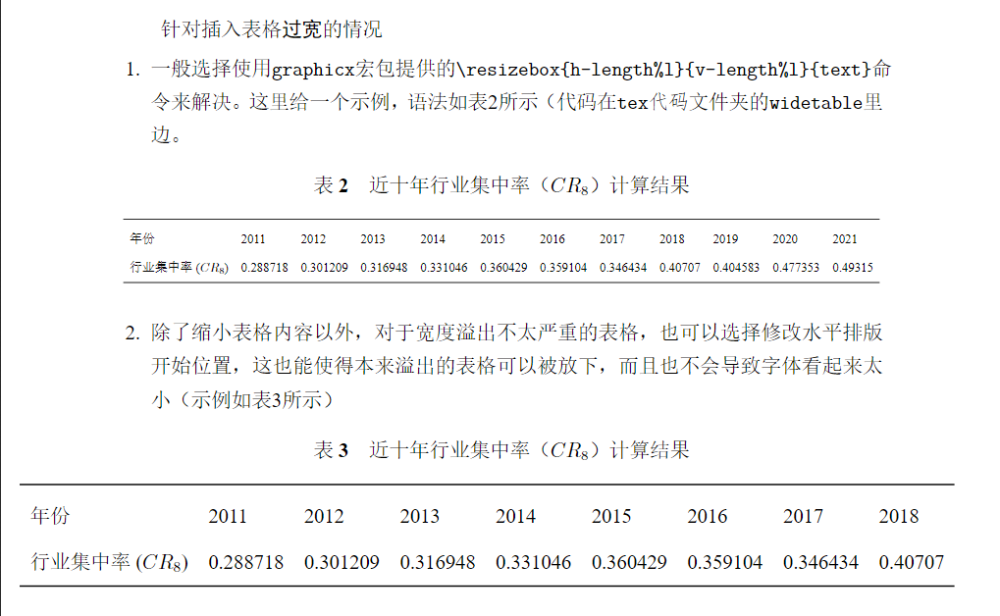
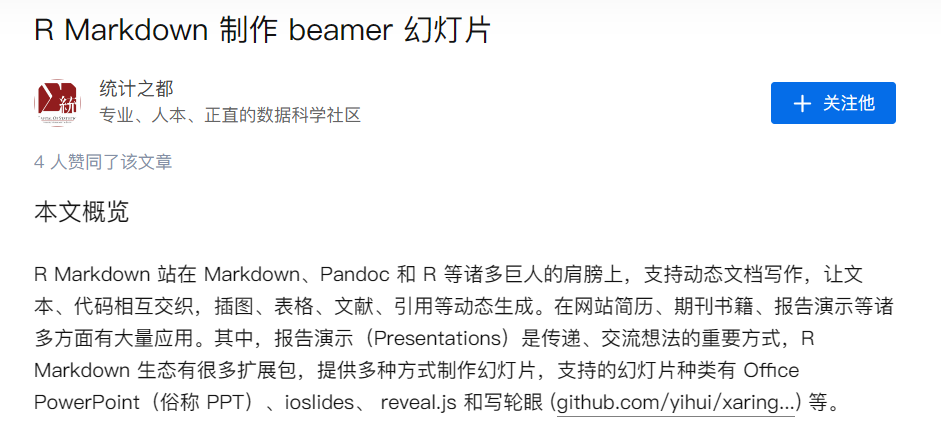

# More Elegent Typesetting Method Using LaTex for Pythoners
A simple latex template for course paper. As a beginner of Latex and a pythoner, I feel so good using python to produce beautiful data visualization and latex tables using `pd.DataFrame.to_latex()`. I can also use latex to generate my paper efficiently with the help of python while not so good at latex. 

Maybe many methods in [guide pdf](guide.pdf) are not the best way in the latex world, but they are the preferred way for pythoner. This repo just provides a guide to use python to generate latex paper. 
# Python+Latex=?
# 更适合Pythoner的latex排版方法
## Why LaTex
坦白来说，Word作为一种文字处理软件，但并不是文字排版的最佳选择：
* 轻量编辑上，Markdown很好迎合了文字轻量排版的需求，在typora等编辑器的加持下甚至可以通过引入css进行任意程度的美化
* 如果对排版有更高的要求(如论文的撰写)，$\LaTeX$则是一种更好的选择（文献引用、格式**控制**、双向引用）

在大学课程中，少不了要撰写课程论文，虽然这种论文不会对格式有很严格的要求，但是参考文献的索引设置也是一个非常麻烦的事情，这也是弃用Markdown转向$\LaTeX$的主要原因（当然部分编辑器的Markdown也有插入脚注的功能，私以为这背离了Markdown的产品定位，且我觉得Markdown在文献引用问题的解决上甚至逊于Word）
## Why not only LaTex
**毫不夸张地说，$\LaTeX$可以实现Word几乎所有的功能**，从这个角度来说，其实LaTex和Word是有共通之处的，但是不可否认他们都存在一个很显著的问题——他们都只能用来呈现结果，都不能做到**自动化**，这也是我用Python辅助Latex排版的主要原因。$\LaTeX$在每次编译时会重新更新访问最新的插入文件，这其实就是一定程度上的自动化，这也给了我使用Python辅助LaTex排版的空间。
## What can Python offer
这里强调一点，**自动化办公的好处在于重复多次进行时，能帮你省去很多不必要的繁琐步骤**。就科研论文排版来说，如果能保证第一次插入的图和表就是完全完美不做任何修改的，那么其实使用Python的意义也没有那么大。这里主要介绍我会使用Python辅助$\LaTeX$排版的两个场景：
* 数据可视化图的排版，如果使用Python来生成数据可视化的图片，那么只要保证保存位置和$\LaTeX$插入图片时引用位置是同一位置。那么在使用Python对图片微调之后，只需重新编译tex代码就可以将最新的图片插入到文献中，从而省去了传统排版中的复制粘贴重命名操作
* 计算结果数据表的排版，$\LaTeX$的表格排版一直是饱受诟病的一点，尽管可以借助一些类似[Tables Generator](https://www.tablesgenerator.com/)的excel to LaTex网站，但是当涉及到表格数据的更新等问题时将会是一个非常棘手的事情。当然，我觉得反复导出excel到网站再生成tex代码也很浪费时间。因为我平时会使用Python计算和建模，因此尝试使用Python直接导出tex代码也就成了一个更高效的路径。这点主要借助`pandas.DataFrame.to_latex()`函数完成，该函数能将`DataFrame`转换为tex代码，借助$\LaTeX$的`\input`命令可以实现与图片更新类似的效果，基本上所有的长表和宽表都可以通过调整函数的参数获得，排版效果如下:

# 一点探索
随着信息呈现形式的多样化，传统的图和表已经不是结果呈现的最好方式。就Python而言，notebook或许才是更好的选择，但就像上边提到的，notebook的`cell`组织形式决定了其永远不可能替代$\LaTeX$完成论文排版。但是作为定位科研工作者的R语言，似乎为这一问题提供了一个更好的解决方案，之前谢益辉大佬也曾将R Markdown和notebook对比，不得不承认R Markdown可能才是能将上述流程自动化的最佳工具(统计之都最近就在知乎发文提出了使用R Markdown代替$\LaTeX$完成幻灯片展示，见下图)

技术的迭代更新需要时间，$\LaTeX$目前依然是我排版课程论文的最佳选择，这里只是想为提高排版效率提供一些自己的建议
# WebLaTex
[WebLaTex](https://github.com/sanjib-sen/WebLaTex):a tool for compiling tex files online, better choice than overleaf